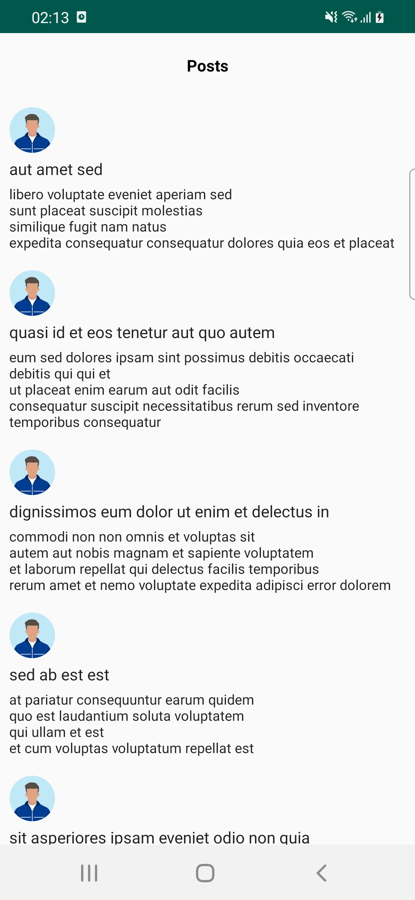

# Android-code-challenge 

## About

Blah blah

## Features

The android app lets you:
- Show user post with avatar.
- Show error screen when api fails.
- Show error screen api key is invalid.
- Show error screen when no interter connection
- Retry when there is an error.

## Screenshots

| Success   |      Loading      |  Api Error | Technical Error | No Internet connection |
|----------|:-------------:|------:|------:|------:|
|  |   |  |  |  |

## Android components and libraries used

- Jetpack Compose.
- AndroidX Navigation Component.
- Coroutines.
- Flow.
- Coil - To Load image
- Retrofit
- Gson
- Kotest - Unitest framework
- Espresso
- Github Actions - For CI/CD

## Run Application
Make sure you connected device/emulator

./gradlew assembleDebug
./gradlew installDebug

## Run Unit tests and UI tests

./gradlew testDebugUnitTest
./gradlew connectedAndroidTest

